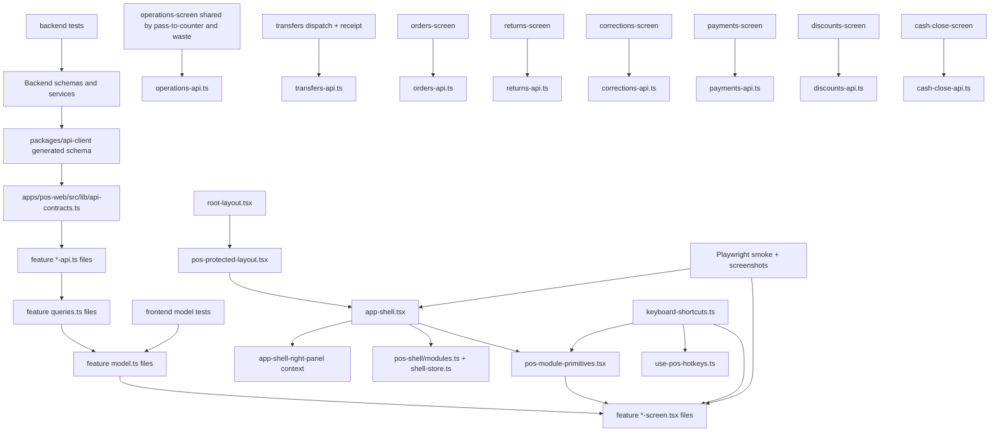

# ZeroMerma POS Master Plan Map

Generated from repository inspection on 2026-04-22.

Scope of this document:
- map the current POS frontend structure
- map shared layout/component primitives
- map API client and backend router/module boundaries
- map current test coverage
- identify cross-cutting implementation dependencies and risks
- recommend an execution order for the master remediation plan

This document is intentionally implementation-oriented. It does not propose contract changes.

## 1. Current POS module map

### 1.1 Route tree and entry flow

Current route registration lives in `apps/pos-web/src/router.tsx`.

Protected route flow:

1. `apps/pos-web/src/routes/root-layout.tsx`
2. `apps/pos-web/src/features/pos-bootstrap/pos-protected-layout.tsx`
3. `apps/pos-web/src/components/app-shell.tsx`
4. route wrapper in `apps/pos-web/src/routes/*`
5. module screen in `apps/pos-web/src/features/*/*-screen.tsx`

Public routes:
- `/login`
- `/health`

Protected routes:
- `/`
- `/cash-session/open`
- `/pos`
- `/pasar-a-mostrador`
- `/enviar-a-sucursal`
- `/recibir-envio`
- `/pedidos`
- `/tickets`
- `/devoluciones`
- `/correcciones`
- `/registrar-merma`
- `/pagos`
- `/descuentos`
- `/cerrar-turno`

### 1.2 Route-to-screen map

| Route | Route file | Real feature entry | Notes |
| --- | --- | --- | --- |
| `/login` | `apps/pos-web/src/routes/login.tsx` | `apps/pos-web/src/features/auth/login-page.tsx` | Public route. |
| `/cash-session/open` | `apps/pos-web/src/routes/cash-session-open.tsx` | `apps/pos-web/src/features/cash-session-open/cash-session-open-screen.tsx` | Cash session gate before operating. |
| `/pos` | `apps/pos-web/src/routes/pos.tsx` | `apps/pos-web/src/features/pos-terminal/pos-terminal-workspace.tsx` | Adds bootstrap and active cash-session guard before rendering POS. |
| `/pasar-a-mostrador` | `apps/pos-web/src/routes/pass-to-counter.tsx` | `apps/pos-web/src/features/operations/operation-module-screen.tsx` with `variant="counterTransfer"` | Shared operations screen. |
| `/registrar-merma` | `apps/pos-web/src/routes/waste.tsx` | `apps/pos-web/src/features/operations/operation-module-screen.tsx` with `variant="waste"` | Shared operations screen. |
| `/enviar-a-sucursal` | `apps/pos-web/src/routes/send-to-branch.tsx` | `apps/pos-web/src/features/transfers/dispatch-screen.tsx` | Transfer dispatch flow. |
| `/recibir-envio` | `apps/pos-web/src/routes/receive-transfer.tsx` | `apps/pos-web/src/features/transfers/receipt-screen.tsx` | Transfer receipt flow. |
| `/pedidos` | `apps/pos-web/src/routes/orders.tsx` | `apps/pos-web/src/features/orders/orders-screen.tsx` | Large multi-mode screen: create, consult, deliver, cancel. |
| `/tickets` | `apps/pos-web/src/routes/tickets.tsx` | `apps/pos-web/src/features/tickets/tickets-screen.tsx` | Includes print flow in feature folder. |
| `/devoluciones` | `apps/pos-web/src/routes/returns.tsx` | `apps/pos-web/src/features/returns/returns-screen.tsx` | Return search + draft capture. |
| `/correcciones` | `apps/pos-web/src/routes/corrections.tsx` | `apps/pos-web/src/features/corrections/corrections-screen.tsx` | Document correction flow. |
| `/pagos` | `apps/pos-web/src/routes/payments.tsx` | `apps/pos-web/src/features/payments/payments-screen.tsx` | Consultation + creation. |
| `/descuentos` | `apps/pos-web/src/routes/discounts.tsx` | `apps/pos-web/src/features/discounts/discounts-screen.tsx` | Consultation + creation. |
| `/cerrar-turno` | `apps/pos-web/src/routes/shift-close.tsx` | `apps/pos-web/src/features/cash-close/cash-close-screen.tsx` | Cash close and reconciliation. |

### 1.3 Frontend feature bundle map

Current pattern per module is mostly:
- `*-screen.tsx` for orchestration and view composition
- `*-api.ts` for handwritten HTTP bindings
- `queries.ts` for TanStack Query hooks
- `model.ts` for local UI grammar / payload building / validation
- `*.test.ts` for model-level tests

| Module | Screen / workspace | Supporting files |
| --- | --- | --- |
| Auth | `features/auth/login-page.tsx`, `login-form.tsx` | `auth-api.ts`, `auth-store.ts` |
| POS bootstrap / shell gate | `features/pos-bootstrap/pos-protected-layout.tsx` | `queries.ts`, `route-state.ts`, `route-state.test.ts` |
| POS terminal | `features/pos-terminal/pos-terminal-workspace.tsx`, `pos-checkout-panel.tsx` | `pos-terminal-api.ts`, `queries.ts`, `store.ts`, `store.test.ts`, `use-pos-hotkeys.ts`, `model.ts` |
| Cash session open | `features/cash-session-open/cash-session-open-screen.tsx`, `cash-session-open-form.tsx`, `cash-session-active-state.tsx` | `cash-session-api.ts`, `queries.ts` |
| Operations | `features/operations/operation-module-screen.tsx` | `operations-api.ts`, `queries.ts`, `model.ts`, `model.test.ts` |
| Transfers | `features/transfers/dispatch-screen.tsx`, `receipt-screen.tsx` | `transfers-api.ts`, `queries.ts`, `model.ts`, `model.test.ts` |
| Orders | `features/orders/orders-screen.tsx` | `orders-api.ts`, `queries.ts`, `model.ts`, `model.test.ts` |
| Tickets | `features/tickets/tickets-screen.tsx` | `tickets-api.ts`, `queries.ts`, `print.ts`, `print.test.ts` |
| Returns | `features/returns/returns-screen.tsx` | `returns-api.ts`, `queries.ts`, `model.ts`, `model.test.ts` |
| Corrections | `features/corrections/corrections-screen.tsx` | `corrections-api.ts`, `queries.ts`, `model.ts`, `model.test.ts` |
| Payments | `features/payments/payments-screen.tsx` | `payments-api.ts`, `queries.ts`, `model.ts`, `model.test.ts` |
| Discounts | `features/discounts/discounts-screen.tsx` | `discounts-api.ts`, `queries.ts`, `model.ts`, `model.test.ts` |
| Cash close | `features/cash-close/cash-close-screen.tsx` | `cash-close-api.ts`, `queries.ts`, `model.ts`, `submit.ts`, `ui.tsx`, `ui-support.ts`, `model.test.ts`, `submit.test.ts` |

### 1.4 Immediate architecture observations

- Route files are thin wrappers; real work belongs in `features/*`.
- `orders-screen.tsx`, `operation-module-screen.tsx`, `returns-screen.tsx`, `corrections-screen.tsx`, `payments-screen.tsx`, `discounts-screen.tsx`, and `cash-close-screen.tsx` are the main orchestration surfaces and likely remediation hotspots.
- The operations family already shares one screen between `Pasar a mostrador` and `Registrar merma`; any transversal work there will affect both variants.
- Transfers already split into dispatch and receipt screens, but still share one `transfers-api.ts` and one `model.ts`.

## 2. Current shared component map

### 2.1 Shell, layout, and navigation primitives

| File | Responsibility |
| --- | --- |
| `apps/pos-web/src/routes/root-layout.tsx` | Public vs protected route split. |
| `apps/pos-web/src/features/pos-bootstrap/pos-protected-layout.tsx` | Auth guard, bootstrap loading, cash-session gate, shell mounting. |
| `apps/pos-web/src/components/app-shell.tsx` | Global POS shell: top bar, sidebar, right panel, command palette, responsive drawers. |
| `apps/pos-web/src/components/app-shell-right-panel.tsx` | Context bridge that lets feature screens own the shell right panel. |
| `apps/pos-web/src/features/pos-shell/modules.ts` | Canonical POS sidebar module registry. |
| `apps/pos-web/src/features/pos-shell/shell-store.ts` | Sidebar collapsed state and last operational path persistence. |
| `apps/pos-web/src/features/pos-theme/theme.ts` | Branch-aware theme tokens and outline button styling. |
| `apps/pos-web/src/styles.css` | Global POS shell tokens, layout rules, and utility classes. |

### 2.2 Shared POS composition primitives

Primary local primitive file:
- `apps/pos-web/src/components/pos-module-primitives.tsx`

Important exported primitives already reused across modules:
- `WorkstationPanel`
- `CentralWorkspaceSheet`
- `ListDetailShell` / `ResponsivePaneLayout`
- `ListDetailColumn`
- `SectionHeader`
- `RightPanelBlock`
- `SectionCard`
- `CompactInfoTile`
- `KeyValueGroup`
- `SummaryMetric`
- `ModuleStateChip`
- `FilterButton`
- `SegmentedControl`
- `FlowGuide`
- `SelectableListCard`
- `SearchField`
- `InlineNotice`
- `ScrollPane`

Implication:
- a local POS composition system already exists;
- the master plan should extend these primitives before inventing new ones.

### 2.3 Other current UI building blocks

| File | Responsibility |
| --- | --- |
| `apps/pos-web/src/components/catalog-selection-card.tsx` | Shared catalog/class/product selection card. |
| `apps/pos-web/src/components/catalog-visual.tsx` | Shared product/class visual tile support. |
| `apps/pos-web/src/components/operational-status.tsx` | Loading / failure / empty operational state shell. |
| `apps/pos-web/src/components/status-messages.tsx` | Toast/status viewport. |
| `apps/pos-web/src/components/pos-icons.tsx` | Shared icon set used across POS modules. |
| `apps/pos-web/src/components/ui/button.tsx` | Local button primitive used heavily in POS. |

### 2.4 Workspace package already present

There is an existing shared UI package:
- `packages/ui/src/*`

Current exports include:
- `Button`
- `Card`
- `DialogSurface`
- `Field`
- `Input`
- `Select`
- `Textarea`
- `SectionHeader`
- `KpiTile`
- `EmptyState`
- `Skeleton`

Current POS implementation still relies primarily on local POS-specific primitives and tokens, not on a separate new design system layer. That matches the repo rule to extend existing primitives instead of introducing parallel UI architecture.

### 2.5 Current keyboard / focus / hotkey utilities

Shared utilities already present:

| File | Responsibility |
| --- | --- |
| `apps/pos-web/src/lib/keyboard-shortcuts.ts` | Selection shortcuts (`1..0`), editable-target detection, relative/edge focus helpers. |
| `apps/pos-web/src/features/pos-terminal/use-pos-hotkeys.ts` | POS-only global hotkeys for class/product selection, search, and back navigation. |
| `apps/pos-web/src/components/app-shell.tsx` | Global `Ctrl/Cmd + K` command palette and `Escape` handling for drawers. |

Shared focus primitives already consume the utility layer:
- `SelectableListCard` uses `focusRelativeItem` and `focusEdgeItem`
- `FlowGuide` uses the same navigation helpers

Current reality:
- keyboard infrastructure exists, but it is not fully centralized across all modules;
- several screens still own local focus choreography internally, especially:
  - `orders-screen.tsx`
  - `operation-module-screen.tsx`
  - `cash-close-screen.tsx`
  - `payments-screen.tsx`
  - `discounts-screen.tsx`
  - `returns-screen.tsx`
  - `corrections-screen.tsx`
  - `tickets-screen.tsx`
  - `transfers/*`

Implication:
- transversal focus/hotkey work should consolidate on top of `keyboard-shortcuts.ts`, not add another keyboard layer.

## 3. Current API endpoint / module map

### 3.1 Frontend contract stack

Contract flow today:

1. Backend schemas define the source of truth.
2. Generated OpenAPI TypeScript types live in `packages/api-client/src/generated/schema.ts`.
3. `packages/api-client/src/index.ts` re-exports generated `components`, `paths`, `operations`, `webhooks`.
4. POS web consumes generated types through `apps/pos-web/src/lib/api-contracts.ts`.
5. Each feature implements handwritten `*-api.ts` functions over `apps/pos-web/src/lib/http.ts`.
6. Each feature wraps calls with TanStack Query in `queries.ts`.

Implication:
- contract drift control is already backend-first;
- the master plan should keep `api-contracts.ts` as the frontend alias layer and avoid handwritten shared domain contracts.

### 3.2 Low-level HTTP and query plumbing

| File | Responsibility |
| --- | --- |
| `apps/pos-web/src/lib/http.ts` | `requestJson`, auth header injection, API error parsing. |
| `apps/pos-web/src/lib/api.ts` | Small generic endpoints like `/health`. |
| `apps/pos-web/src/lib/api-contracts.ts` | Frontend type aliases sourced from generated backend schema. |
| `apps/pos-web/src/lib/query-client.ts` | Global TanStack Query client. |

### 3.3 Feature API client map

| Frontend feature | Handwritten API file | Main backend prefix |
| --- | --- | --- |
| Cash session open | `features/cash-session-open/cash-session-api.ts` | `/v1/cash-sessions` |
| POS terminal | `features/pos-terminal/pos-terminal-api.ts` | `/v1/sales`, plus bootstrap/current cash session dependencies |
| Operations | `features/operations/operations-api.ts` | `/v1/operations` |
| Transfers | `features/transfers/transfers-api.ts` | `/v1/transfers` |
| Orders | `features/orders/orders-api.ts` | `/v1/orders` |
| Tickets | `features/tickets/tickets-api.ts` | `/v1/tickets` |
| Returns | `features/returns/returns-api.ts` | `/v1/returns` |
| Corrections | `features/corrections/corrections-api.ts` | `/v1/corrections` |
| Payments | `features/payments/payments-api.ts` | `/v1/payments` |
| Discounts | `features/discounts/discounts-api.ts` | `/v1/discounts` |
| Cash close | `features/cash-close/cash-close-api.ts` | `/v1/cash-close` |
| POS bootstrap | `features/pos-bootstrap/pos-bootstrap-api.ts` | identity / branches / cash-session support APIs |

### 3.4 Backend router registration

Central backend router registration lives in:
- `apps/api/src/zeromerma_api/presentation/api.py`

FastAPI app creation lives in:
- `apps/api/src/zeromerma_api/main.py`

Current router registration order:
- health
- dev_audit
- identity
- branches
- catalog
- cash
- cash_close
- corrections
- discounts
- operations
- orders
- payments
- returns
- tickets
- transfers
- sales

Database session dependency is centralized in:
- `apps/api/src/zeromerma_api/db/session.py`

### 3.5 Backend module and endpoint map

Focused modules for the master plan:

| Module | Router file | Prefix | Current endpoints |
| --- | --- | --- | --- |
| Cash sessions | `apps/api/src/zeromerma_api/modules/cash/presentation/router.py` | `/v1/cash-sessions` | `POST /open`, `GET /current` |
| Sales / POS | `apps/api/src/zeromerma_api/modules/sales/presentation/router.py` | `/v1/sales` | `POST /confirm`, `GET /{sale_id}` |
| Operations | `apps/api/src/zeromerma_api/modules/operations/presentation/router.py` | `/v1/operations` | `GET /bootstrap`, `GET /catalog`, `GET /classes/{class_id}/products`, `POST /counter-transfer/commit`, `POST /waste/commit` |
| Orders | `apps/api/src/zeromerma_api/modules/orders/presentation/router.py` | `/v1/orders` | `GET /bootstrap`, `GET /`, `GET /catalog`, `GET /classes/{class_id}/products`, `GET /{order_id}`, `POST /`, `POST /{order_id}/mark-ready`, `POST /{order_id}/deliver`, `POST /{order_id}/cancel` |
| Tickets | `apps/api/src/zeromerma_api/modules/tickets/presentation/router.py` | `/v1/tickets` | `GET /bootstrap`, `GET /`, `GET /{ticket_id}`, `POST /{ticket_id}/reprint` |
| Returns | `apps/api/src/zeromerma_api/modules/returns/presentation/router.py` | `/v1/returns` | `GET /bootstrap`, `GET /search-sales`, `GET /sales/{sale_id}`, `GET /classes/{class_id}/products`, `POST /commit`, `GET /{return_id}` |
| Corrections | `apps/api/src/zeromerma_api/modules/corrections/presentation/router.py` | `/v1/corrections` | `GET /bootstrap`, `GET /search`, `GET /products`, `GET /{target_document_id}`, `POST /commit` |
| Payments | `apps/api/src/zeromerma_api/modules/payments/presentation/router.py` | `/v1/payments` | `GET /bootstrap`, `GET /`, `GET /{payment_id}`, `POST /` |
| Discounts | `apps/api/src/zeromerma_api/modules/discounts/presentation/router.py` | `/v1/discounts` | `GET /bootstrap`, `GET /`, `GET /{discount_id}`, `POST /` |
| Cash close | `apps/api/src/zeromerma_api/modules/cash_close/presentation/router.py` | `/v1/cash-close` | `GET /bootstrap`, `GET /summary`, `GET /reconciliation`, `POST /preview`, `POST /commit`, `GET /{close_id}` |
| Transfers | `apps/api/src/zeromerma_api/modules/transfers/presentation/router.py` | `/v1/transfers` | `POST /dispatch/commit`, `GET /inbound/pending`, `GET /{transfer_id}`, `POST /{transfer_id}/receive` |

Each backend module already follows the same internal shape:
- `presentation/router.py`
- `application/services.py`
- `application/schemas.py`
- `domain/*`
- `infrastructure/models.py`

This is the cohesion boundary the remediation should keep.

## 4. Current test coverage map

### 4.1 Frontend tests

Frontend unit and model tests currently exist in `apps/pos-web/src/**/*.test.ts`.

Current coverage areas:
- environment bootstrap: `src/env.test.ts`
- app metadata: `src/lib/app-metadata.test.ts`
- POS bootstrap route state: `features/pos-bootstrap/route-state.test.ts`
- POS theme: `features/pos-theme/theme.test.ts`
- POS terminal store/model: `features/pos-terminal/store.test.ts`
- operations model: `features/operations/model.test.ts`
- orders model: `features/orders/model.test.ts`
- returns model: `features/returns/model.test.ts`
- corrections model: `features/corrections/model.test.ts`
- transfers model: `features/transfers/model.test.ts`
- payments model: `features/payments/model.test.ts`
- discounts model: `features/discounts/model.test.ts`
- cash close model/submit helpers: `features/cash-close/model.test.ts`, `submit.test.ts`
- tickets print: `features/tickets/print.test.ts`

Current frontend e2e coverage:
- `apps/pos-web/e2e/pos-entry.spec.ts`
- `apps/pos-web/e2e/operational-modules-screenshots.spec.ts`

Practical implication:
- frontend confidence today is strongest at model layer;
- screen-level behavior is covered mostly by end-to-end smoke/visual checks, not by focused component tests.

### 4.2 Backend tests

Backend tests currently live in `apps/api/tests`.

Current module coverage:
- `test_phase_1a_pos_bootstrap.py`
- `test_phase_2a_pos_sales.py`
- `test_phase_3a_operations.py`
- `test_phase_4a_corrections.py`
- `test_phase_7a_cash_close.py`
- `test_phase_7b_cash_close.py`
- `test_orders_module.py`
- `test_returns_module.py`
- `test_tickets_module.py`
- `test_payments_module.py`
- `test_discounts_module.py`
- `test_dev_audit_snapshot.py`
- `test_health.py`

Shared test infrastructure:
- `apps/api/tests/conftest.py`
  - Alembic migrations to head
  - seeded database reset via `seed_local_data`
  - `TestClient(create_app())`
  - direct DB assertions via `SessionLocal`

Practical implication:
- backend module-level coverage already exists for all critical operational domains in scope;
- that is the safest place to extend rules before changing frontend behavior.

### 4.3 Current coverage gaps relevant to the master plan

- No focused frontend tests for shell layout and right-panel injection.
- No dedicated component tests for most `*-screen.tsx` files.
- Keyboard/focus flows outside POS are mostly validated implicitly, not through shared utilities or targeted tests.
- Cross-module shell regressions currently rely heavily on the large screenshot spec.

## 5. Implementation dependency graph

## 6. Risks before implementation

1. **Large orchestration files**
   - `orders-screen.tsx`, `operation-module-screen.tsx`, `returns-screen.tsx`, `corrections-screen.tsx`, `payments-screen.tsx`, `discounts-screen.tsx`, and `cash-close-screen.tsx` are large and already mix composition, local focus logic, and state wiring.
   - Cross-cutting UI changes will converge in these files quickly if primitives are not extended first.

2. **Shell coupling**
   - `app-shell.tsx` owns the global shell, command palette, responsive drawers, and default right-panel content.
   - `useAppShellRightPanel` allows each screen to override the shell right panel, which is powerful but creates cross-module coupling.

3. **Shared operations screen**
   - `Pasar a mostrador` and `Registrar merma` use the same `operation-module-screen.tsx`.
   - Any remediation here must preserve variant behavior without splitting architecture.

4. **Contract alias surface**
   - `apps/pos-web/src/lib/api-contracts.ts` is a large alias layer over generated backend schema.
   - Contract changes must start in backend schemas and then regenerate; never patch frontend types first.

5. **Focus logic is partly centralized and partly local**
   - shared utilities exist, but multiple modules still own their own focus choreography.
   - introducing another focus system would create drift immediately.

6. **Screen-first refactors are risky without model alignment**
   - many modules encode operational grammar in `model.ts` and derive payloads/blockers there.
   - visual changes that bypass model semantics will drift from backend behavior.

7. **Test profile**
   - backend confidence is good at module level;
   - frontend confidence is weaker at screen composition level;
   - the screenshot e2e spec is broad and sensitive to many unrelated layout changes.

8. **Right-panel duplication risk**
   - several modules already depend on the pattern "center = work surface, right = summary/control".
   - any master-plan remediation should preserve that boundary to avoid repeating earlier duplication issues.

## 7. Recommended execution order matching master plan phases

### Phase 0 - Baseline map and constraints
- Deliver and keep this map current.
- Freeze the canonical architecture assumptions:
  - backend-first contracts
  - shell-first transversal work
  - no parallel design system

### Phase 1 - Transversal shell and primitive cleanup
- Target files:
  - `components/app-shell.tsx`
  - `components/app-shell-right-panel.tsx`
  - `components/pos-module-primitives.tsx`
  - `features/pos-shell/modules.ts`
  - `features/pos-theme/theme.ts`
  - `styles.css`
- Goal:
  - normalize central-vs-right-panel responsibilities
  - stabilize reusable table/list/detail primitives
  - define the canonical shell grammar before module-by-module remediation

### Phase 2 - Keyboard, focus, and operability foundations
- Target files:
  - `lib/keyboard-shortcuts.ts`
  - `features/pos-terminal/use-pos-hotkeys.ts`
  - local focus-heavy screens beginning with `orders-screen.tsx`
- Goal:
  - consolidate reusable focus/hotkey behavior
  - avoid per-screen reinvention before changing workflows

### Phase 3 - POS core and access gates
- Target files:
  - `features/auth/*`
  - `features/pos-bootstrap/*`
  - `features/cash-session-open/*`
  - `features/pos-terminal/*`
- Goal:
  - stabilize entry flow, session gating, POS capture shell, and checkout panel
  - this is the foundation for every later module

### Phase 4 - Shared operational movement family
- Target files:
  - `features/operations/*`
  - `features/transfers/*`
- Goal:
  - align product/class/quantity grammar across counter transfer, waste, dispatch, and receipt
  - remediate shared composition patterns before customer-facing document flows

### Phase 5 - Customer order lifecycle
- Target files:
  - `features/orders/*`
- Goal:
  - create/consult/ready/deliver/cancel flows
  - right-panel action hierarchy
  - payment/settlement ergonomics

### Phase 6 - Post-sale audit and exception flows
- Target files:
  - `features/tickets/*`
  - `features/returns/*`
  - `features/corrections/*`
- Goal:
  - align these modules around tabular consultation and fast right-panel operational capture
  - preserve auditability while reducing UI noise

### Phase 7 - Operational finance side modules
- Target files:
  - `features/payments/*`
  - `features/discounts/*`
- Goal:
  - keep them lightweight, table-first, and visually consistent with backoffice/POS consultation patterns

### Phase 8 - Cash close and reconciliation
- Target files:
  - `features/cash-close/*`
- Goal:
  - close/reconciliation depends on upstream capture consistency from POS, operations, orders, returns, corrections, payments, and discounts

### Phase 9 - Contract sync and test hardening
- Target files:
  - backend `application/schemas.py`
  - `packages/api-client/src/generated/schema.ts`
  - `apps/pos-web/src/lib/api-contracts.ts`
  - backend module tests
  - frontend model tests
  - selected Playwright flows
- Goal:
  - regenerate contracts only after backend changes
  - add targeted tests around new shared primitives and high-risk workflows

## 8. Immediate execution guidance for the next remediation prompt

Use this map as the dependency baseline.

The next prompt should start with **Phase 1 transversal POS shell and primitive cleanup**, not with a single module feature change. The reasons are structural:
- all protected routes flow through the same shell
- all right-panel work depends on `app-shell-right-panel.tsx`
- most modules already use `pos-module-primitives.tsx`
- later module prompts will otherwise keep re-solving the same layout and hierarchy problem locally

Suggested first implementation target:
- normalize shell/central/right-panel responsibilities and the reusable list/detail/table primitives before further module-specific remediation.
