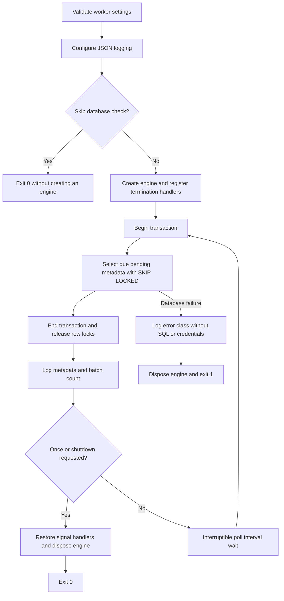

# Worker foundation baseline

ZM-FIN-011 characterizes the independent Python worker before business consumers exist.
The worker starts, polls metadata, and stops in a controlled way. A successful poll does
not mean an event was handled, delivered, retried, or acknowledged.

## Current cycle



`OutboxPoller.poll_once()` selects only `pending` rows whose `processed_at` is null and
whose `available_at` is due, ordered by `occurred_at`, up to the configured batch size.
It returns the number observed. An empty table returns zero. It does not select or validate
the payload. An unknown event or a JSON payload that is invalid for the domain remains
untouched. Every persisted column is unchanged after polling, including attempts and status.

Locks exist only during the select transaction. Another worker skips a row while it is
locked, but both workers can observe the same row after the transaction ends. This is
intentional characterization of the incomplete implementation, not a delivery guarantee.

## Configuration and execution

Settings use the `ZEROMERMA_WORKER_` prefix, with process environment overriding `.env`
in the current working directory. Unrelated `.env` settings are ignored.

| Variable suffix | Default | Validation |
| --- | --- | --- |
| `ENVIRONMENT` | `local` | Environment label |
| `LOG_LEVEL` | `INFO` | DEBUG, INFO, WARNING, ERROR, CRITICAL; normalized to uppercase |
| `DATABASE_URL` | Local development PostgreSQL URL | `postgresql+psycopg`, host and database required |
| `DATABASE_CONNECT_TIMEOUT_SECONDS` | `5` | Integer from 1 to 60 |
| `POLL_INTERVAL_SECONDS` | `5` | Positive integer |
| `BATCH_SIZE` | `25` | Integer from 1 to 500 |

The new optional connect timeout bounds connection establishment. It is not a SQL statement
timeout and does not provide cancellation of an in-flight query. Production environment
hardening and secret rotation remain in their respective security/platform tasks.

From the repository root, after the canonical frozen workspace install:

```powershell
uv run --frozen --project apps/worker python -m zeromerma_worker --once --skip-db-check
uv run --frozen --project apps/worker python -m zeromerma_worker --once
uv run --frozen --project apps/worker python -m zeromerma_worker
```

The first command never creates a database engine. The other commands use the configured
worker database; validation below instead provisions an isolated, disposable test database.
`--once` exits after a single poll. The continuous process handles `SIGINT`/`SIGTERM` by
requesting shutdown and waking the polling wait. It finishes any active poll, restores
the previous signal handlers, releases the engine, and exits zero. `KeyboardInterrupt`
also exits cleanly. OS force-kill is not graceful shutdown. Signal registration belongs
to the main thread; embedded non-main-thread calls do not replace process handlers.

Invalid settings exit 2 and identify only invalid field names. Database failures exit 1,
release resources, and log the exception class without raw driver text, SQL, or credentials.
Unexpected errors propagate after disposal. There is no automatic database retry yet.

## Executed validation

Executed on 2026-09-12 with Python 3.12.6, uv 0.11.4, Node 22.23.2, pnpm 10.33.0,
and a disposable PostgreSQL 16 container. No operational database was used.

| Command | Observed result |
| --- | --- |
| `uv run --frozen ruff check apps/worker` | `All checks passed!` |
| `uv run --frozen mypy apps/worker/src` | `Success: no issues found in 10 source files` |
| `uv run --frozen pytest apps/worker/tests` | `26 passed in 5.70s` |
| `./scripts/dev/run-api-tests.ps1 -TestTarget apps/worker/integration_tests` | `4 passed in 10.55s` |

The PostgreSQL run identity was `6001cb1e07fc43d0b7bb9e75a061e466`; the database was
`zeromerma_test_6001cb1e07fc43d0b7bb9e75a061e466`. The existing safe harness allocated a
loopback port and tmpfs container, supplied the test-only role and run-bound confirmation,
and removed the container afterward. Worker integration fixtures reuse the canonical
preconnect/postconnect guards and upgrade the canonical Alembic chain before fixture SQL.
They have no fallback to the API or worker operational URL.

The discovered unit suite covers settings boundaries, environment isolation, log-level
normalization, configuration redaction, engine timeout configuration, no-DB startup,
single polling, termination signals, keyboard interruption, SQLAlchemy failures,
unexpected failure cleanup, empty batches, metadata-only polling, and transaction cleanup.
The real unavailable-database CLI test reserves a non-listening loopback socket, so no
database server can receive the attempted connection.

The integration suite proves empty-table behavior, pending/due/processed filtering, batch
limits, unchanged persisted rows, malformed domain payload preservation, row-lock behavior
between two pollers, and a real `python -m zeromerma_worker --once` subprocess. The subprocess
emits `worker_booted`, `outbox_message_ready`, `outbox_poll_completed`, and `worker_stopped`
with `reason=poll_once_completed`; the test asserts that fixture payload data is absent.
Signal tests invoke the real installed signal handlers in-process with a controlled poller.
The PostgreSQL subprocess validation uses `--once`; it does not claim an external OS signal
delivery drill for every deployment platform.

## Remaining worker work

- ZM-FIN-087: durable claim/lease/state transitions, attempts, backoff, dead-letter handling,
  and recovery. The present worker can repeatedly report the same pending event forever.
- ZM-FIN-088: registered business handlers and idempotent consumers; no consumer exists here.
- ZM-FIN-089: readiness, backlog/age/throughput metrics, backpressure, and recovery tooling.
- ZM-FIN-090–093: scheduler, alerts, notifications, versioned events, and analytical projections.

No database migrations, OpenAPI changes, frontend changes, business handlers, event status
mutations, or exactly-once claims are introduced by this baseline. The master task text
references ZM-FIN-073–077 as subsequent work, but the canonical worker implementation tasks
are ZM-FIN-087–093; this document preserves that distinction without renumbering the plan.
